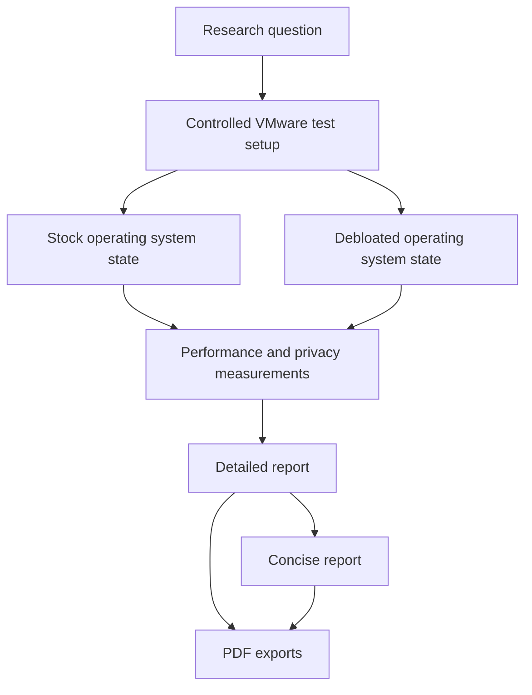

# Operating System Debloating Research Reports

This repository contains report files for a study on how operating system
debloating affects performance and privacy. The project is a documentation and
research artefact repository. It does not contain executable debloating scripts,
application source code, APIs, a database, automated tests, or deployment files.

## Table of contents

- [Quick start](#quick-start)
- [Project overview](#project-overview)
- [Problem statement](#problem-statement)
- [Project goals](#project-goals)
- [Key features](#key-features)
- [Supported use cases](#supported-use-cases)
- [Document set](#document-set)
- [System architecture](#system-architecture)
- [Research workflow](#research-workflow)
- [Technology stack](#technology-stack)
- [Repository structure](#repository-structure)
- [Prerequisites](#prerequisites)
- [Local installation](#local-installation)
- [Dependency installation](#dependency-installation)
- [Environment configuration](#environment-configuration)
- [Running the project](#running-the-project)
- [Available commands](#available-commands)
- [Research methodology](#research-methodology)
- [Operating systems covered](#operating-systems-covered)
- [Measured results](#measured-results)
- [Repository metrics](#repository-metrics)
- [Software runtime areas](#software-runtime-areas)
- [Security considerations](#security-considerations)
- [Performance considerations](#performance-considerations)
- [Monitoring and maintenance](#monitoring-and-maintenance)
- [Troubleshooting](#troubleshooting)
- [Known limitations](#known-limitations)
- [Contribution guidelines](#contribution-guidelines)
- [Coding standards](#coding-standards)
- [Licence](#licence)
- [Support and contact information](#support-and-contact-information)

## Quick start

Run these commands from the repository root in Windows PowerShell.

| Step | Command                         | What it does                            | Expected result                                              | Common problem and resolution                                                |
| ---- | ------------------------------- | --------------------------------------- | ------------------------------------------------------------ | ---------------------------------------------------------------------------- |
| 1    | `Get-ChildItem -File`           | Lists the files in the repository root. | Shows the report files, README, and config files.            | If no report files are shown, run the command from the repository root.      |
| 2    | `Start-Process .\Detailed.pdf`  | Opens the full research report PDF.     | The detailed 15 page report opens in the default PDF reader. | If the command fails, check the file exists with `Test-Path .\Detailed.pdf`. |
| 3    | `Start-Process .\Concise.pdf`   | Opens the short research report PDF.    | The concise 5 page report opens in the default PDF reader.   | If no PDF reader is configured, open the file manually from File Explorer.   |
| 4    | `Start-Process .\Detailed.docx` | Opens the editable detailed report.     | The document opens in Microsoft Word or a compatible editor. | If no editor is installed, use the PDF version for reading.                  |

No build, server, package installation, database setup, or environment variable
setup is required for the current repository.

## Project overview

The study analyses whether removing unnecessary applications, background
services, startup tasks, and telemetry components can improve desktop operating
system performance and reduce background data transmission.

The repository contains two report formats:

- A detailed report for full methodology, observations, results, discussion,
  conclusion, and references.
- A concise report for a shorter summary of the same study.

The research compares stock, debloated, enterprise, custom, and minimal
operating system configurations under controlled virtual machine conditions.
The stated report date is October 2025.

## Problem statement

Modern desktop operating systems can include bundled applications, redundant
services, telemetry processes, and vendor integrations that consume CPU, RAM,
disk I/O, network bandwidth, and storage. These components may reduce
responsiveness and increase privacy risk through background data transmission.

The research question in the report is:

> To what extent does debloating objectively improve operating system
> performance and reduce telemetry based privacy risks across different versions
> and configurations of Windows and Linux when evaluated in standardised virtual
> machine environments?

## Project goals

- Measure the effect of debloating on boot time, idle RAM usage, idle CPU usage,
  disk I/O, and background process count.
- Measure the effect of debloating on outbound network connections and telemetry
  related processes.
- Compare Windows, Linux, enterprise Windows, custom Windows builds, and minimal
  Linux configurations.
- Identify trade offs between performance, privacy, update support, security
  services, compatibility, and long term maintainability.

## Key features

- Two report versions are available in editable DOCX and fixed PDF formats.
- The detailed report documents methodology, test environment, operating systems,
  debloating procedures, metrics, results, discussion, conclusion, and references.
- The concise report provides a shorter summary with one comparative result
  table.
- The study includes Windows 10 Pro, Windows 10 LTSC 2021, Windows 11 Pro,
  Ghost Spectre Windows 11 SuperLite, AtlasOS Windows 11, ReviOS Windows 11,
  Linux Mint 22.1 Cinnamon, Ubuntu 22.04 LTS, and Arch Linux with XFCE.
- The documented test method uses identical VMware Workstation virtual machine
  settings and three run averages.

## Supported use cases

- Read the full research report.
- Read a short version of the research report.
- Review the stated methodology before reproducing the experiment externally.
- Compare reported debloating effects across Windows and Linux variants.
- Edit the DOCX reports and regenerate the PDFs manually.

Not supported by the current repository:

- Running automated debloating scripts from this repository.
- Running benchmarks from this repository.
- Starting a local web application or API.
- Running automated tests or CI jobs.

## Document set

| File               | Format          |   Verified details | Purpose                                                                                  |
| ------------------ | --------------- | -----------------: | ---------------------------------------------------------------------------------------- |
| `Detailed.docx`    | Word document   | 9,753 parsed words | Editable full research report.                                                           |
| `Detailed.pdf`     | PDF             |           15 pages | Fixed format full research report.                                                       |
| `Concise.docx`     | Word document   | 2,334 parsed words | Editable short research report.                                                          |
| `Concise.pdf`      | PDF             |            5 pages | Fixed format short research report.                                                      |
| `README.md`        | Markdown        |          This file | Repository documentation.                                                                |
| `.gitattributes`   | Git config      |           68 bytes | Enables automatic text file line ending normalisation.                                   |
| `.prettierrc.json` | Prettier config |           41 bytes | Defines tab based formatting preferences. This file is present in the current workspace. |

## System architecture

This is not a software runtime architecture. It is a research artefact flow.



## Research workflow

1. Install each operating system from an official or verified ISO.
2. Apply updates and configure a baseline state.
3. Record baseline performance and privacy metrics.
4. Create a virtual machine snapshot.
5. Apply debloating procedures.
6. Reboot and allow the system to stabilise.
7. Record the same metrics again under identical conditions.
8. Repeat measurements across three runs and calculate averages.
9. Compare stock, debloated, enterprise, custom, and minimal configurations.
10. Publish the findings in detailed and concise report formats.

## Technology stack

| Technology             | Version                              | Purpose                                                    | Where it is used                        | Why it is needed                                                              |
| ---------------------- | ------------------------------------ | ---------------------------------------------------------- | --------------------------------------- | ----------------------------------------------------------------------------- |
| Markdown               | Not specified                        | Repository documentation                                   | `README.md`                             | Gives plain text documentation that can be rendered by Git hosting platforms. |
| Microsoft Word DOCX    | Not specified                        | Editable report format                                     | `Detailed.docx`, `Concise.docx`         | Stores the editable versions of the reports.                                  |
| PDF                    | Not specified                        | Fixed layout report format                                 | `Detailed.pdf`, `Concise.pdf`           | Provides stable reading copies of the reports.                                |
| VMware Workstation     | Version not specified in the reports | Experimental virtualisation environment                    | Research methodology in `Detailed.docx` | Provides controlled virtual machine resources and snapshots.                  |
| Wireshark              | Version not specified in the reports | Network observation                                        | Research methodology in `Detailed.docx` | Captures outbound network activity and telemetry endpoints.                   |
| Windows PowerShell     | Version not specified in the reports | Windows debloating tool entry point and service inspection | Research methodology in `Detailed.docx` | Used for Winutil launch and Windows service queries in the experiment.        |
| systemd tools          | Version not specified in the reports | Linux service inspection and control                       | Research methodology in `Detailed.docx` | Used to inspect and disable Linux services.                                   |
| Linux package managers | Not specified                        | Linux package removal                                      | Research methodology in `Detailed.docx` | Used to remove unused packages in tested Linux distributions.                 |

## Repository structure

```text
.
|-- .gitattributes
|-- .prettierrc.json
|-- Concise.docx
|-- Concise.pdf
|-- Detailed.docx
|-- Detailed.pdf
`-- README.md
```

Important files:

- `.gitattributes` normalises text file line endings.
- `.prettierrc.json` contains formatting preferences for tools that support
  Prettier.
- `Concise.docx` is the editable short report.
- `Concise.pdf` is the fixed layout short report.
- `Detailed.docx` is the editable full report.
- `Detailed.pdf` is the fixed layout full report.
- `README.md` explains the repository and its contents.

## Prerequisites

For reading the repository:

- Git, if you want to clone or inspect history.
- Windows PowerShell, if you want to run the quick start commands as written.
- A PDF reader for `Detailed.pdf` and `Concise.pdf`.
- Microsoft Word, LibreOffice, or another DOCX compatible editor for
  `Detailed.docx` and `Concise.docx`.

For reproducing the research outside this repository:

- VMware Workstation or a comparable virtualisation tool.
- Operating system ISO files for the tested Windows and Linux variants.
- Network capture tools such as Wireshark.
- Operating system tools such as Task Manager, Resource Monitor, `systemctl`,
  `free -m`, `htop`, `iotop`, `iostat`, `ps`, `tcpdump`, and PowerShell.

## Local installation

There is no application installation step. After obtaining the repository, open
the report files directly.

If you want to verify the repository contents, run:

```powershell
Get-ChildItem -File
```

Expected result: the command lists the DOCX reports, PDF reports, README, and
configuration files in the repository root.

## Dependency installation

No package dependencies are declared in the current repository.

There is no `package.json`, `requirements.txt`, `pyproject.toml`, Dockerfile, or
compose file.

## Environment configuration

No environment variables are used by the current repository.

| Variable       | Required | Purpose                        | Expected format | Safe example value | Default value  | Security notes           |
| -------------- | -------- | ------------------------------ | --------------- | ------------------ | -------------- | ------------------------ |
| Not applicable | No       | No application runtime exists. | Not applicable  | Not applicable     | Not applicable | No secrets are required. |

## Running the project

There is no runnable application. Use the repository by opening the report files.

Open the full PDF report:

```powershell
Start-Process .\Detailed.pdf
```

Open the concise PDF report:

```powershell
Start-Process .\Concise.pdf
```

Open the editable full report:

```powershell
Start-Process .\Detailed.docx
```

## Available commands

These commands are for repository inspection and document opening only.

| Command                         | Run from        | Purpose                          | Expected result                               |
| ------------------------------- | --------------- | -------------------------------- | --------------------------------------------- |
| `Get-ChildItem -File`           | Repository root | Lists root files.                | Shows DOCX, PDF, README, and config files.    |
| `Start-Process .\Detailed.pdf`  | Repository root | Opens the full PDF report.       | Default PDF reader opens the detailed report. |
| `Start-Process .\Concise.pdf`   | Repository root | Opens the short PDF report.      | Default PDF reader opens the concise report.  |
| `Start-Process .\Detailed.docx` | Repository root | Opens the editable full report.  | DOCX editor opens the detailed report.        |
| `Start-Process .\Concise.docx`  | Repository root | Opens the editable short report. | DOCX editor opens the concise report.         |
| `git status --short`            | Repository root | Checks uncommitted changes.      | Shows changed or untracked files, if any.     |

## Research methodology

The detailed report states the following controlled setup:

- Hypervisor: VMware Workstation.
- Virtual machine resources: 4 virtual CPU cores, 8 GB RAM, 50 GB virtual SSD,
  bridged networking, and GPU acceleration where supported.
- Host hardware: Intel Core i7 9750H, 16 GB physical RAM, and SSD storage.
- Baseline: clean snapshot after operating system installation and initial
  configuration.
- Measurement approach: three consecutive runs with reboots between measurements.
- Stabilisation period: two minutes after boot before idle measurements.
- Windows debloating: Chris Titus Tech Winutil, manual removal of unwanted apps,
  telemetry services, startup tasks, and scheduled tasks, while preserving update,
  security, driver, networking, display, and audio services.
- Linux debloating: package removal and service review through package managers
  and `systemctl`.
- Privacy observation: outbound network monitoring through Wireshark, `tcpdump`,
  process lists, and service lists.

The detailed report documents this Windows tool entry point:

```powershell
irm "https://christitus.com/win" | iex
```

This repository does not execute that command. Review any external script before
running it on a real system.

## Operating systems covered

| Platform                           | Configuration described in the reports                                         |
| ---------------------------------- | ------------------------------------------------------------------------------ |
| Windows 10 Pro                     | Stock and debloated using Winutil.                                             |
| Windows 10 LTSC 2021               | Enterprise oriented baseline and selective debloat.                            |
| Windows 11 Pro                     | Stock and debloated using Winutil.                                             |
| Ghost Spectre Windows 11 SuperLite | Custom Windows 11 build with aggressive component removal.                     |
| AtlasOS Windows 11                 | Custom Windows 11 playbook focused on minimal latency and gaming use.          |
| ReviOS Windows 11                  | Custom Windows 11 build focused on a balance of performance and compatibility. |
| Linux Mint 22.1 Cinnamon           | Stock and selectively debloated desktop Linux configuration.                   |
| Ubuntu 22.04 LTS GNOME             | Stock and selectively debloated desktop Linux configuration.                   |
| Arch Linux with XFCE               | Minimal installation used as a lean baseline.                                  |

## Measured results

These values are taken from `Detailed.docx` and `Concise.docx`. Several values
are approximate because the reports present them as approximate measurements.

| System                             | RAM result                                                  | Boot time result                                  | Telemetry result                                          | Stability or trade off                                                                                       |
| ---------------------------------- | ----------------------------------------------------------- | ------------------------------------------------- | --------------------------------------------------------- | ------------------------------------------------------------------------------------------------------------ |
| Windows 10 Pro                     | About 2.5 GB to 1.6 GB, 36% reduction.                      | 42 s to 29 s, 31% faster.                         | 12 endpoints to 4 endpoints, 67% fewer.                   | Stable with Windows Update and Defender retained.                                                            |
| Windows 10 LTSC 2021               | 1.8 GB to 1.5 GB, about 17% reduction.                      | 31 s to 28 s, about 10% faster.                   | 2 endpoints to 1 endpoint.                                | Stable, with smaller gains because LTSC is already leaner.                                                   |
| Windows 11 Pro                     | 2.8 GB to 1.7 GB, 39% reduction.                            | 44 s to 30 s, 32% faster.                         | 15 endpoints to 3 endpoints, 80% fewer.                   | Stable with core Windows services retained.                                                                  |
| Ghost Spectre Windows 11 SuperLite | 1.3 GB idle RAM, about 54% lower than stock Windows 11 Pro. | 26 s, about 41% faster than stock Windows 11 Pro. | Virtually zero idle telemetry in the report.              | Microsoft Store, Edge integration, and some Windows features removed.                                        |
| AtlasOS Windows 11                 | 1.1 GB idle RAM and fewer than 65 background processes.     | 23 s, fastest Windows result in the report.       | Zero unsolicited outbound idle connections in the report. | Strong compatibility and maintenance trade offs; some security and update functions require manual handling. |
| ReviOS Windows 11                  | 1.4 GB idle RAM and about 90 background processes.          | 25 s.                                             | Minimal Windows Update connectivity.                      | Reported as the most balanced custom Windows option.                                                         |
| Linux Mint 22.1 Cinnamon           | 1.4 GB to 1.1 GB, 21% reduction.                            | 35 s to 28 s, 20% faster.                         | Minimal update related traffic only.                      | Stable with desktop functionality preserved.                                                                 |
| Ubuntu 22.04 LTS GNOME             | 1.9 GB to 1.3 GB, 32% reduction.                            | 38 s to 32 s.                                     | Reduced to occasional update checks.                      | Snap removal affects access to snap packaged applications.                                                   |
| Arch Linux with XFCE               | About 400 MB to 380 MB, about 5% reduction.                 | 15 s to 14 s.                                     | No unsolicited outbound idle connections.                 | Already minimal, so debloating is mostly unnecessary.                                                        |

The detailed report states that variance between most repeated runs was less
than 5%.

## Repository metrics

| Metric                          |                          Verified value | Source or command used                     | Notes                                                                 |
| ------------------------------- | --------------------------------------: | ------------------------------------------ | --------------------------------------------------------------------- |
| Visible root files              |                                       7 | `Get-ChildItem -File`                      | Includes `.prettierrc.json` in the current workspace.                 |
| Git tracked files               |                                       6 | `git ls-files`                             | `.prettierrc.json` is present but untracked in the current workspace. |
| DOCX files                      |                                       2 | `rg --files`                               | `Detailed.docx` and `Concise.docx`.                                   |
| PDF files                       |                                       2 | `rg --files`                               | `Detailed.pdf` and `Concise.pdf`.                                     |
| Detailed PDF pages              |                                      15 | Python `pypdf` page count                  | Verified from `Detailed.pdf`.                                         |
| Concise PDF pages               |                                       5 | Python `pypdf` page count                  | Verified from `Concise.pdf`.                                          |
| Detailed DOCX parsed words      |                                   9,753 | Python DOCX XML extraction                 | Count is based on parsed Word text.                                   |
| Concise DOCX parsed words       |                                   2,334 | Python DOCX XML extraction                 | Count is based on parsed Word text.                                   |
| Source code files               |                                       0 | `rg --files` with common source extensions | No application source files are present.                              |
| Package or dependency manifests |                                       0 | Repository file scan                       | No package manager manifest is present.                               |
| API endpoints                   |                                       0 | Repository file scan                       | No server source files are present.                                   |
| Environment variables           |                                       0 | Secret and environment pattern scan        | No runtime environment variables are used.                            |
| Automated test files            |                                       0 | Repository file scan                       | No test harness is present.                                           |
| Database models or migrations   |                                       0 | Repository file scan                       | No database files are present.                                        |
| Docker or compose files         |                                       0 | Repository file scan                       | No container configuration is present.                                |
| CI or CD workflows              |                                       0 | Repository file scan                       | No workflow directory is present.                                     |
| Test coverage percentage        | Not measured in the current repository. | Not applicable                             | No automated tests are present.                                       |
| Build time                      | Not measured in the current repository. | Not applicable                             | No build process is present.                                          |
| Bundle size                     | Not measured in the current repository. | Not applicable                             | No application bundle is present.                                     |
| Default ports                   | Not measured in the current repository. | Not applicable                             | No server is present.                                                 |
| Rate limits                     | Not measured in the current repository. | Not applicable                             | No API is present.                                                    |

## Software runtime areas

| Area                             | Status in this repository                                                                    |
| -------------------------------- | -------------------------------------------------------------------------------------------- |
| API documentation                | Not applicable. No API routes are present.                                                   |
| Authentication and authorisation | Not applicable. No application runtime exists.                                               |
| Input validation                 | Not applicable. No application input handling exists.                                        |
| Error handling                   | Not applicable. No application error handling code exists.                                   |
| Logging                          | Not applicable. No application logging code exists.                                          |
| Database setup                   | Not applicable. No database files, migrations, schemas, or seeds are present.                |
| Automated testing                | Not applicable. No automated tests are present.                                              |
| Code quality checks              | Not applicable for source code. `.prettierrc.json` exists, but no package script is present. |
| Build process                    | Not applicable. PDFs are already committed, and no build script is present.                  |
| Production deployment            | Not applicable. This repository does not deploy a service.                                   |
| CI or CD process                 | Not applicable. No CI or CD workflow files are present.                                      |

## Security considerations

- No application secrets, API keys, tokens, passwords, database URLs, or runtime
  environment variable references were found during the README inspection scan.
- The reports discuss operating system debloating, which can affect security
  updates, driver support, Microsoft Defender, system restore, and application
  compatibility if done aggressively.
- The report recommends preserving update, security, driver, networking, display,
  and audio services when applying balanced debloating.
- Custom Windows builds can reduce background activity, but the reports identify
  trade offs in update compatibility, feature availability, and maintenance.
- External debloating scripts should be reviewed before use. This repository
  stores reports only and does not vendor or execute those scripts.

## Performance considerations

The repository itself has no runtime performance profile because it contains
documents and configuration files only.

The performance findings belong to the research reports. They are based on
controlled virtual machine tests, so physical hardware can show different
absolute results because of CPU generation, storage type, firmware, drivers,
power management, and thermal behaviour.

## Monitoring and maintenance

To maintain the repository:

- Keep `Detailed.docx` as the full editable source report.
- Keep `Concise.docx` as the short editable source report.
- Regenerate the matching PDFs after document edits.
- Update this README when report files, metrics, methodology, or conclusions
  change.
- Recheck OS versions, tool behaviour, and telemetry patterns when reproducing
  the study after major operating system updates.
- Keep research measurements tied to a stated date because operating system
  updates can change background services and telemetry behaviour.

## Troubleshooting

| Problem                                    | Likely cause                                                           | Diagnostic command          | Resolution                                                                                                |
| ------------------------------------------ | ---------------------------------------------------------------------- | --------------------------- | --------------------------------------------------------------------------------------------------------- |
| `Detailed.pdf` does not open.              | The command is run outside the repository root or the file is missing. | `Test-Path .\Detailed.pdf`  | Run the command from the repository root or restore the missing file.                                     |
| DOCX file does not open.                   | No DOCX compatible editor is installed.                                | `Test-Path .\Detailed.docx` | Use the PDF version or install Microsoft Word, LibreOffice, or another compatible editor.                 |
| Quick start command is not recognised.     | Commands are being run in a shell other than Windows PowerShell.       | `$PSVersionTable.PSVersion` | Use Windows PowerShell or open the files manually.                                                        |
| Expected source scripts are not found.     | The repository currently stores reports only.                          | `rg --files`                | Use the methodology in `Detailed.docx` to recreate experiments externally.                                |
| Git shows `.prettierrc.json` as untracked. | The file exists in the workspace but is not tracked by Git.            | `git status --short`        | Add it intentionally if it should be part of the repository, or leave it untracked if it is local config. |

## Known limitations

- The repository does not include raw benchmark data, packet captures, scripts,
  screenshots, VM configuration exports, or automation used to produce the
  reports.
- The reported measurements were performed in virtual machines. Physical systems
  can produce different absolute values.
- Battery behaviour is not fully represented by virtual machine testing.
- The stated results reflect operating system and tool behaviour as of October 2025.
- Some report references point to external sources whose current content may
  change over time.
- No licence file is present.

## Contribution guidelines

If you update this repository:

1. Edit the relevant DOCX source file first.
2. Regenerate the matching PDF after DOCX changes.
3. Keep the concise and detailed reports consistent where they describe the same
   measurements.
4. Update this README when files, commands, metrics, or methodology change.
5. Do not add claims to the README unless they are supported by files in the
   repository.
6. Do not commit generated temporary files from Word, PDF tools, or local editors.

## Coding standards

There is no application code in the current repository.

If scripts are added later:

- Keep them small and directly tied to the research workflow.
- Document every command needed to run them.
- Preserve update and security related safeguards when documenting debloating.
- Add tests or direct verification commands for any nontrivial automation.
- Avoid storing secrets, tokens, local machine paths, or personal configuration.

For Markdown in this repository:

- Use simple, technical language.
- Keep claims tied to repository files.
- Use ASCII characters only.
- Keep tables and commands easy to copy.

## Licence

No licence file is present in the current repository. Until a licence is added,
reuse, redistribution, and modification rights are not explicitly granted by this
repository.

## Support and contact information

No separate support channel, issue template, or contact file is present in the
current repository. Use the hosting platform issue tracker if one is configured
for this repository.
